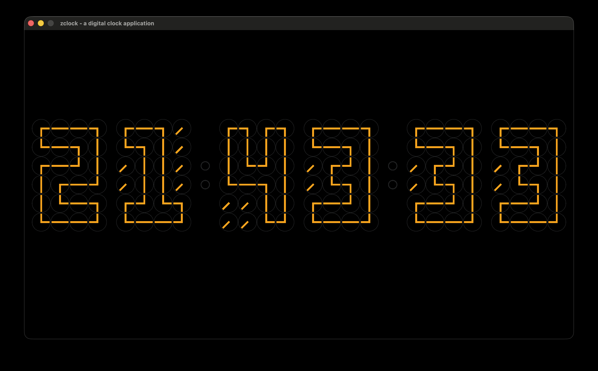

# A digital clock application

zclock is a simple digital clock application created with mini analog clocks. It displays the current time using a grid of small analog clocks, each representing a single digit of the time. The application is built using zig programming language and raylib for rendering.

PS.: It is reimplementation of [Hyperplexed](https://www.youtube.com/watch?v=VUSCH7nQGIM)'s video on YoutTube.

## Images:



## Features

- Displays current time in HH:MM:SS format using mini analog clocks

## Build and Run

To build and run the zclock application, follow these steps:

### Prerequisites

- Install [Zig](https://ziglang.org/download/) programming language (Version 0.15.2 or later)

### Build

1. Clone the repository:

   ```bash
   git clone https://github.com/burakssen/zclock.git
   cd zclock
   ```

2.

- Building for desktop:

  ```bash
  zig build run -Doptimize=ReleaseFast
  ```

- Building for web (WASM):

  ```bash
  zig build run -Dtarget=wasm32-emscripten -Doptimize=ReleaseFast
  ```

## License

This project is licensed under the MIT License. See the [LICENSE](LICENCE) file for details.
